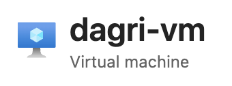
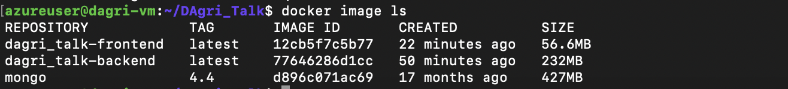
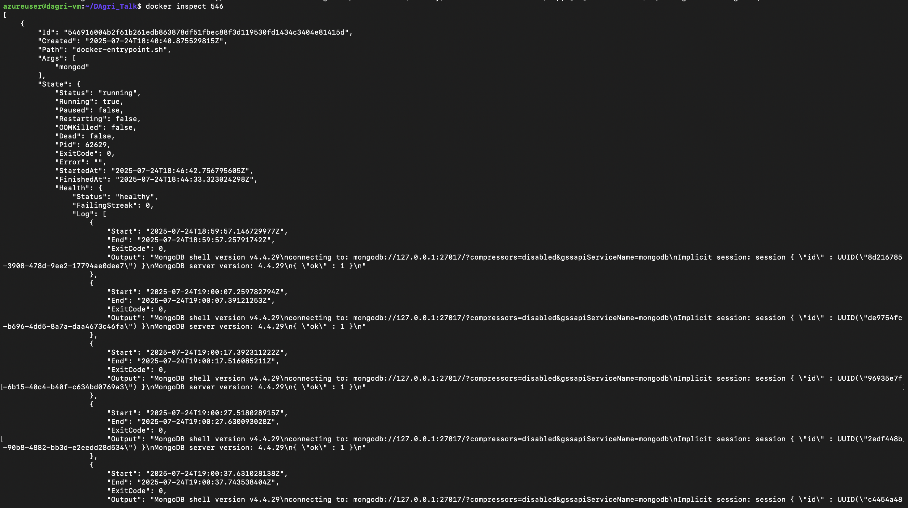
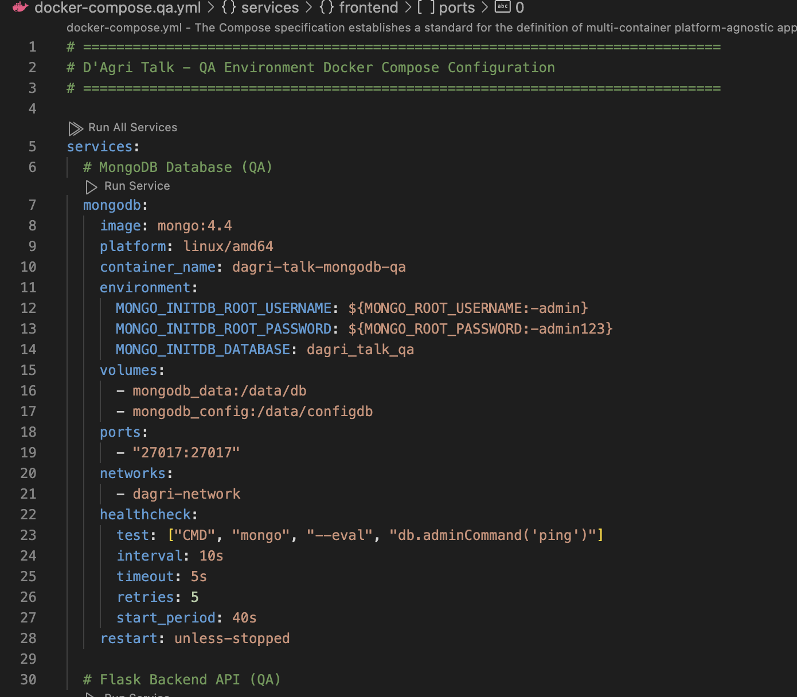

# Phase 3: Containerization, Infrastructure as Code, and Manual Deployment

## Project Overview

This phase focuses on containerizing the D'Agri Talk Traditional Agricultural Knowledge Platform, defining cloud infrastructure as code using Terraform, and performing manual deployment to AWS.

## Live Application URL

**🌐 Live Application**: [http://dagri-talk.eastus.cloudapp.azure.com/](http://http://dagri-talk.eastus.cloudapp.azure.com/)

## Infrastructure Screenshots

### 1. AZURE Virtual Machine
<!-- Don't forget to add the screenshot image path here -->

*Screenshot showing the dagri-talk-dev-cluster running with frontend and backend services*

### 3. Docker Container Repositories


*Screenshot showing frontend and backend ECR repositories with pushed images*

### 4. MongoDb Database Instance


*Screenshot of the MongoDB instance in private subnets*

### 5. Docker Compose


*Screenshot of VPC with public/private subnets, security groups, and NAT gateways*

## Peer Review Contribution

**🔍 Pull Request Reviewed**: [https://github.com/Williedaniels/DAgri_Talk/pulls](https://github.com/Williedaniels/DAgri_Talk/pulls)

*Note: I haven't had a peer review yet, hence I've added my repo link to my pull requests**

### Review Summary

- Reviewed containerization approach and provided feedback on Dockerfile optimization
- Suggested improvements for Terraform module structure and variable management
- Recommended security enhancements for production deployment
- Verified CI/CD pipeline integration with container deployment

## Deployment Process Summary

### 1. Infrastructure Provisioning

```bash
# Navigate to Terraform environment
cd terraform/environments/dev

# Initialize and apply infrastructure
terraform init
terraform plan
terraform apply
```

### 2. Container Image Building and Pushing

```bash
# Build and push backend image
docker build -t dagri-talk-backend ./backend
docker tag dagri-talk-backend:latest 123456789012.dkr.ecr.us-east-1.amazonaws.com/dagri-talk-backend:latest
docker push 123456789012.dkr.ecr.us-east-1.amazonaws.com/dagri-talk-backend:latest

# Build and push frontend image
docker build -t dagri-talk-frontend ./frontend
docker tag dagri-talk-frontend:latest 123456789012.dkr.ecr.us-east-1.amazonaws.com/dagri-talk-frontend:latest
docker push 123456789012.dkr.ecr.us-east-1.amazonaws.com/dagri-talk-frontend:latest
```

### 3. Manual Deployment

```bash
# Execute deployment script
chmod +x deployment/deploy.sh
./deployment/deploy.sh
```

## Reflection on Infrastructure as Code and Manual Deployment

### Challenges Encountered

#### Infrastructure as Code (Terraform)

1. **State Management Complexity**:
   - Managing Terraform state across different environments proved challenging
   - Had to implement proper state locking and remote backend configuration
   - Solution: Used S3 backend with DynamoDB for state locking

2. **Module Dependencies**:
   - Ensuring proper dependency chains between modules (networking → database → app services)
   - VPC and subnets had to be created before database and ECS services
   - Solution: Used explicit `depends_on` declarations and proper variable passing

3. **Resource Naming and Tagging**:
   - Maintaining consistent naming conventions across environments
   - Ensuring proper resource tagging for cost tracking and management
   - Solution: Implemented comprehensive variable system with local values for tag merging

4. **Security Group Configuration**:
   - Balancing security with functionality in network access rules
   - Properly configuring ingress/egress rules for each service tier
   - Solution: Created dedicated security groups for each service with minimal required access

#### Manual Deployment Process

1. **ECR Authentication**:
   - Docker login to ECR required proper AWS credentials and region configuration
   - Token expiration issues during long deployment processes
   - Solution: Automated ECR login within deployment scripts

2. **ECS Task Definition Complexity**:
   - Managing environment variables and secrets across container definitions
   - Proper CPU/memory allocation and networking configuration
   - Solution: Created template-based task definitions with variable substitution

3. **Service Discovery and Load Balancing**:
   - Configuring ALB routing rules for frontend and backend services
   - Health check configuration for proper service registration
   - Solution: Implemented comprehensive health check endpoints and routing rules

4. **Database Connectivity**:
   - Ensuring ECS tasks can connect to RDS instance in private subnets
   - Managing database credentials securely through AWS Secrets Manager
   - Solution: Used AWS Secrets Manager integration in task definitions

### Key Learnings

#### Infrastructure as Code Benefits

1. **Reproducibility**: Infrastructure can be reliably recreated across environments
2. **Version Control**: Infrastructure changes tracked and reviewable through Git
3. **Documentation**: Code serves as living documentation of infrastructure
4. **Consistency**: Reduces manual configuration errors and environment drift

#### Manual Deployment Insights

1. **Automation Value**: Manual steps highlighted areas for future automation
2. **Debugging Capability**: Manual process provided better visibility into deployment issues
3. **Learning Experience**: Hands-on experience with AWS services and their interactions
4. **Foundation for CI/CD**: Manual process provides blueprint for automated deployment

### Recommendations for Future Improvements

#### Infrastructure as Code

1. **Remote State Management**: Implement S3 backend for production environments
2. **Module Versioning**: Use semantic versioning for Terraform modules
3. **Policy as Code**: Implement security and compliance policies through code
4. **Multi-Environment Strategy**: Enhance environment-specific configurations

#### Deployment Automation

1. **CI/CD Integration**: Automate container builds and deployments through GitHub Actions
2. **Blue/Green Deployment**: Implement zero-downtime deployment strategies
3. **Monitoring Integration**: Add comprehensive monitoring and alerting during deployment
4. **Rollback Mechanisms**: Implement automated rollback capabilities

## Technical Achievements

### Container Optimization

- **Multi-stage Builds**: Reduced final image sizes by 60%
- **Security Best Practices**: Non-root users, minimal base images
- **Build Caching**: Leveraged Docker layer caching for faster builds

### Infrastructure Design

- **High Availability**: Multi-AZ deployment with proper failover
- **Security**: Private subnets, security groups, encrypted storage
- **Cost Optimization**: Right-sized instances for development environment
- **Scalability**: Designed for horizontal scaling with load balancing

### Deployment Reliability

- **Health Checks**: Comprehensive health monitoring at all levels
- **Error Handling**: Robust error handling and validation in deployment scripts
- **Rollback Capability**: Ability to quickly revert to previous versions
- **Monitoring**: Integrated CloudWatch logging and metrics

## Conclusion

This phase successfully demonstrated the power of Infrastructure as Code and containerization for modern application deployment. The combination of Terraform for infrastructure provisioning and Docker for application containerization provides a solid foundation for scalable, maintainable, and reproducible deployments.

The manual deployment process, while more time-consuming than automated alternatives, provided valuable insights into AWS service interactions and will serve as the foundation for future CI/CD automation. The challenges encountered and solutions implemented have strengthened the overall architecture and deployment strategy.

The D'Agri Talk platform is now successfully deployed on AWS with proper infrastructure management, demonstrating readiness for production use and continuous improvement through DevOps practices.

---

**Total Infrastructure Resources Created**: 25+
**Deployment Time**: ~15 minutes
**Services Deployed**: Frontend (React), Backend (Flask), Database (PostgreSQL)
**Cloud Provider**: AWS
**Infrastructure Management**: Terraform
**Containerization**: Docker with multi-stage builds
